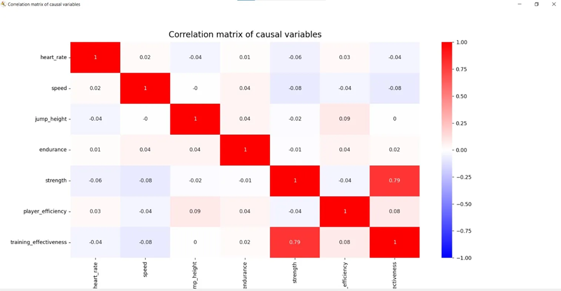
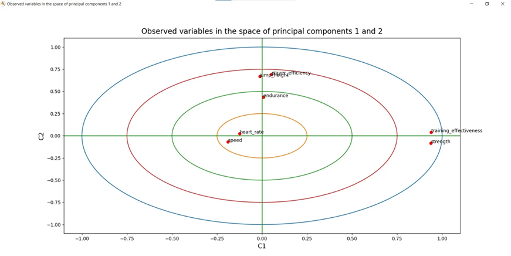

# Basketball Performance Analysis 🏀

## **Building Strength, Maximizing Performance: Where Data Drives Success** 🏋️‍♂️🎯

### **Overview**

This project analyzes basketball player performance data to develop insights for personalized training plans using AI. The analysis focuses on various physical performance metrics and calculates the overall training effectiveness for each player. Through Principal Component Analysis (PCA) and Hierarchical Clustering Analysis (HCA), we identify patterns and relationships between different performance indicators.

### Dataset Information

The dataset simulates performance and training data of 500 basketball players, containing the following metrics:

### **Key Variables**

Heart Rate: 120-180 bpm       
Speed: 8-15 m/s         
Jump Height: 20-40 inches           
Endurance: 10-40 minutes             
Strength: 50-150 kg            
Player Efficiency: 10-30 (scaled index)           
Training Effectiveness: Categorical (0: Low, 1: Moderate, 2: High)

### **Analysis Methods**      

### **Principal Component Analysis (PCA)**

We used PCA to:

Reduce dimensionality while preserving data variance
Identify key performance factors
Reveal patterns in player performance
Improve interpretability of variable relationships

#### **Visualizations**
1. Correlation Matrix

2. Variables in PCA Space

### **Hierarchical Clustering Analysis (HCA)**

We implemented agglomerative hierarchical clustering to:

Discover natural player groupings
Provide interpretable visualization through dendrograms
Capture clusters of varying shapes and sizes
Identify outliers and exceptional performance patterns

### Key Findings

#### **PCA Results**

1. Strong correlation (0.94) between strength and training effectiveness
2. Positive correlations between jump height and player efficiency
3. Distinct components for:

* Strength and effectiveness (Component 1)
* Athletic explosiveness (Component 2)
* Speed-endurance relationship (Component 3)
* Cardiovascular fitness (Component 4)

#### **Clustering Results**

The analysis identified two major clusters:

* Cluster 0 (Majority): Players with similar physical attributes
* Cluster 1 (Minority): Exceptional players or outliers with unique attribute combinations

### **Practical Applications**

#### **Training Focus**

* Prioritize strength training programs
* Monitor heart rate and speed as independent indicators
* Consider player efficiency and jump height as related metrics

**Player Development**

* Implement targeted training based on correlated attributes
* Develop personalized plans based on cluster characteristics
* Focus on improving weaknesses while maintaining strengths

### ****Data Source****

Dataset sourced from Kaggle

